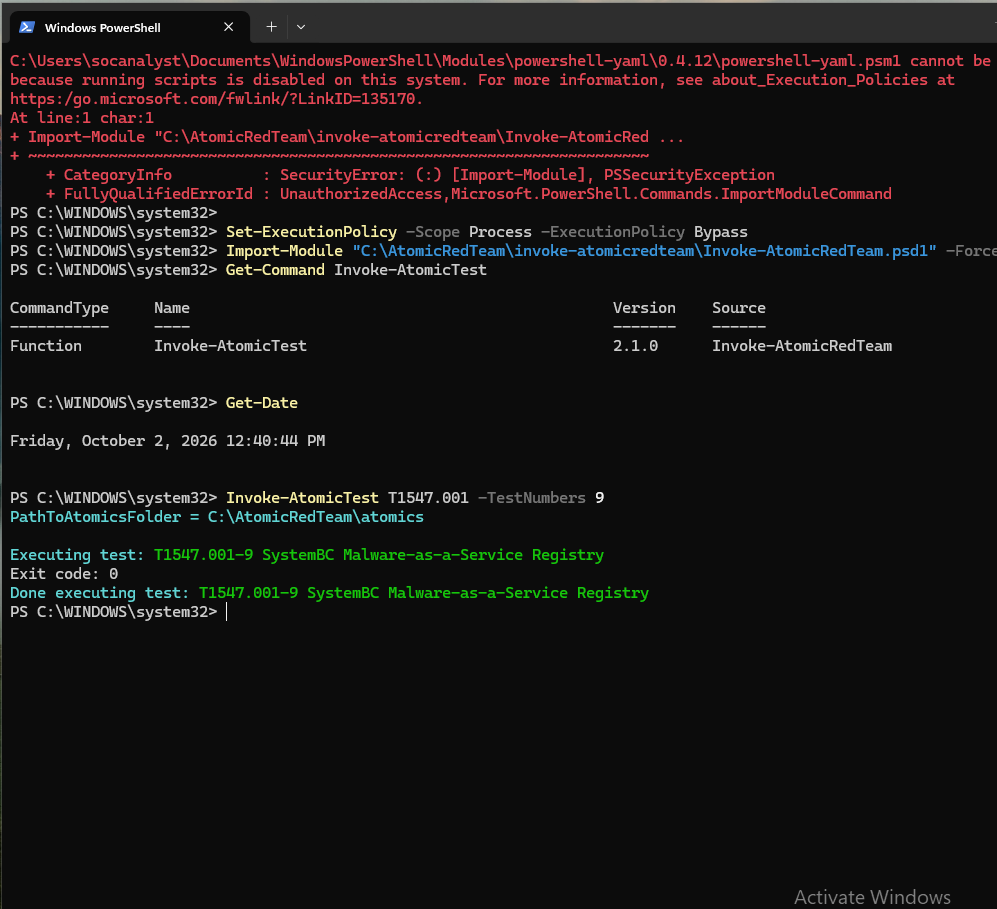
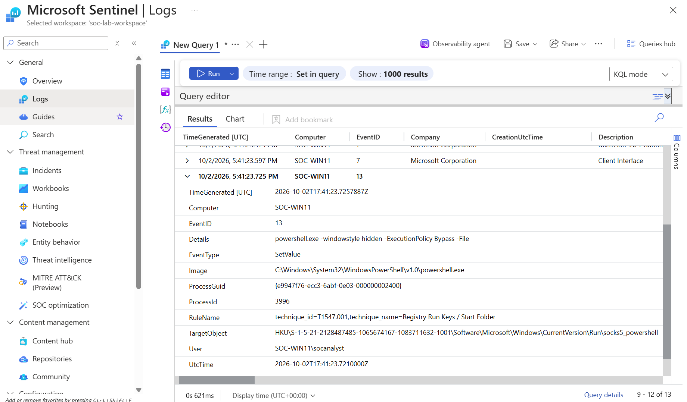
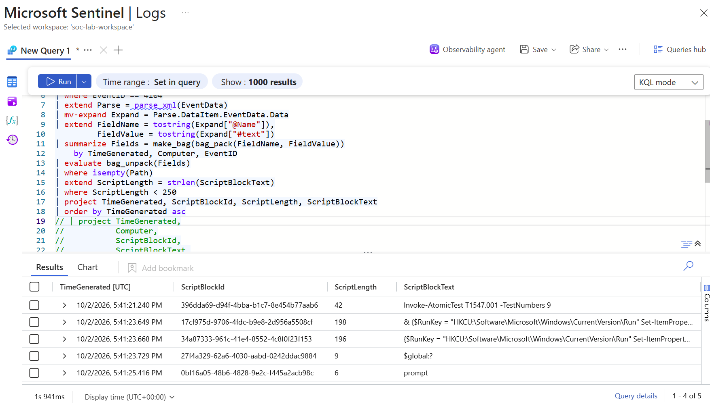
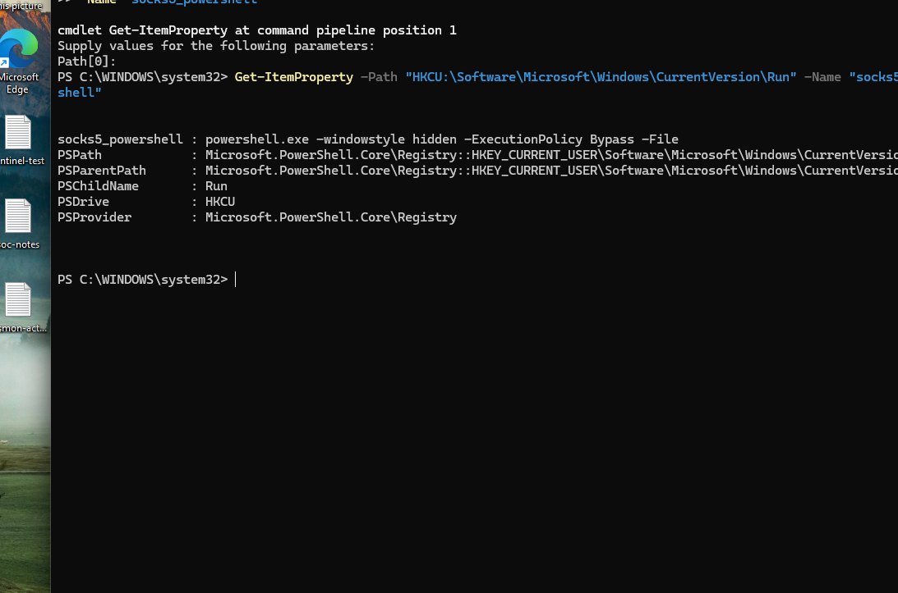
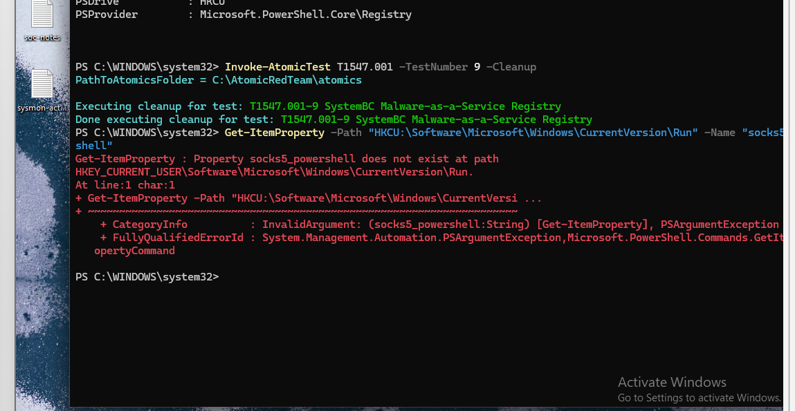

# Microsoft Sentinel SOC Detection Lab

## Project Overview

This project demonstrates a hands-on SOC detection and investigation workflow using Microsoft Sentinel in a controlled Windows 11 lab environment.

I built an endpoint telemetry pipeline using Sysmon, PowerShell Script Block Logging, Azure Monitor Agent, Data Collection Rules, Log Analytics, and Microsoft Sentinel. I then used the environment to develop KQL detection logic, investigate endpoint activity, correlate process and registry telemetry, map behavior to MITRE ATT&CK, validate artifacts directly on the endpoint, and perform remediation verification.

The featured investigation uses Atomic Red Team to simulate registry-based persistence and follows the activity from initial telemetry through investigation and cleanup.

**Analyst workflow:**

**Generate activity -> Detect/Triage -> Reconstruct process relationships -> Correlate telemetry -> Validate endpoint state -> Map to MITRE ATT&CK -> Remediate -> Verify**

---

## Lab Architecture

```text
SOC-WIN11 (Windows 11 Endpoint)
|
|-- Sysmon
|-- PowerShell Script Block Logging
|-- Azure Arc
     |
     v
Azure Monitor Agent (AMA)
     |
     v
Data Collection Rules (DCRs)
     |
     v
Log Analytics Workspace
     |
     v
Microsoft Sentinel
     |
     |-- KQL Hunting / Detection
     |-- Triage
     `-- Investigation
```

Azure Monitor Agent and Data Collection Rules collect configured endpoint telemetry and send it to the Log Analytics workspace used by Microsoft Sentinel.

---

## Core Technologies

| Technology | How It Was Used |
|---|---|
| **Microsoft Sentinel** | SIEM investigation, telemetry analysis, and KQL hunting/detection |
| **Sysmon** | Process, network, image-load, process-access, file, and registry telemetry |
| **PowerShell Script Block Logging** | PowerShell script visibility through Event ID 4104 |
| **Windows Security Events** | Authentication and logon context |
| **KQL** | Parsing, filtering, aggregation, hunting, and evidence correlation |
| **Atomic Red Team** | Controlled adversary simulation |
| **MITRE ATT&CK** | Behavioral technique mapping |

### Telemetry Used

- Sysmon Event ID 1 - Process Creation
- Sysmon Event ID 3 - Network Connection
- Sysmon Event ID 7 - Image Loaded
- Sysmon Event ID 10 - Process Access
- Sysmon Event ID 11 - File Create
- Sysmon Event ID 13 - Registry Value Set
- PowerShell Event ID 4104 - Script Block Logging
- Windows Event ID 4624 - Successful Logon

---

# Featured Investigation: Registry Run Key Persistence

## Controlled Adversary Simulation

Atomic Red Team was used to execute **T1547.001 Test 9 - SystemBC Malware-as-a-Service Registry** on `SOC-WIN11`.

The test created a value named:

```text
socks5_powershell
```

under the current user's Windows Run key.

Rather than treating the known Atomic test as the answer, I investigated the generated telemetry as an analyst and built the conclusion from the available evidence.



---

## Investigation Methodology

I began with a broad review of the surrounding activity window rather than immediately filtering for one expected Event ID.

The investigation progressed through:

1. Timeline review and Event ID distribution
2. Sysmon Event ID 1 process analysis
3. Process ancestry reconstruction using `ProcessGuid` and `ParentProcessGuid`
4. Correlation of telemetry associated with the suspicious PowerShell process
5. Sysmon Event ID 13 registry analysis
6. PowerShell Event ID 4104 script-block investigation
7. Review of supporting and negative evidence
8. Search for subsequent execution of the persistence command
9. Direct endpoint validation
10. Cleanup and independent remediation verification

---

## Key Evidence

Sysmon Event ID 13 showed `powershell.exe` setting:

```text
HKU\<USER-SID>\Software\Microsoft\Windows\CurrentVersion\Run\socks5_powershell
```

with the value:

```text
powershell.exe -windowstyle hidden -ExecutionPolicy Bypass -File
```

The Event ID 13 telemetry shared the same `ProcessGuid` as the PowerShell process identified during process analysis.



PowerShell Event ID 4104 independently exposed script-block content using `Set-ItemProperty` to create the same Run-key value.



### Evidence Timeline

| Time (UTC) | Telemetry | Observation |
|---|---|---|
| 17:41:21.240 | PowerShell 4104 | Atomic test invocation observed |
| 17:41:23.201 | Sysmon Event ID 1 | PowerShell process creation observed |
| 17:41:23.649 | PowerShell 4104 | Run-key modification script observed |
| 17:41:23.721 | Sysmon Event ID 13 | Registry Run-key value modification recorded |

The combined evidence established that PowerShell modified the current user's Windows Run key in a manner consistent with registry-based persistence.

---

## Persistence Execution Check

After confirming that the persistence value had been created, I reviewed subsequent Sysmon Event ID 1 telemetry for a PowerShell process matching the command stored in the Run key.

**No subsequent execution of the persisted PowerShell command was observed within the investigated telemetry window.**

This distinction was important: the evidence demonstrated that persistence was **established**, but did not demonstrate that the persisted command subsequently executed during the period investigated.

---

## Endpoint Validation and Remediation

The registry artifact was then checked directly on `SOC-WIN11`.

```powershell
Get-ItemProperty -Path "HKCU:\Software\Microsoft\Windows\CurrentVersion\Run" -Name "socks5_powershell"
```

The value was still present, confirming the current endpoint state matched the historical SIEM evidence.



Because the activity originated from Atomic Red Team, the corresponding cleanup procedure was used:

```powershell
Invoke-AtomicTest T1547.001 -TestNumber 9 -Cleanup
```

The registry was queried again after cleanup. PowerShell reported that the `socks5_powershell` property no longer existed, independently verifying removal of the persistence artifact.



---

## MITRE ATT&CK Mapping

| Behavior | MITRE ATT&CK |
|---|---|
| Windows Run-key persistence | **T1547.001 - Registry Run Keys / Startup Folder** |

**Tactic:** Persistence

---

## Final Disposition

**Benign - Authorized Security Testing**

The activity originated from a controlled Atomic Red Team simulation. The investigation nevertheless followed an evidence-driven SOC workflow: process analysis, telemetry correlation, persistence identification, execution checking, endpoint validation, remediation, and verification.

### Full Technical Investigation

**[Case 003 - Registry Run Key Persistence Investigation](investigations/case-003-registry-run-key-persistence.md)**

---

# Detection Engineering

## Discovery Burst Detection

Before the featured persistence investigation, I developed and validated a KQL detection for bursts of Windows discovery activity using Sysmon Event ID 1.

The detection monitors discovery utilities such as:

- `whoami.exe`
- `hostname.exe`
- `ipconfig.exe`
- discovery-related `net.exe` activity

The query groups activity by endpoint, user, and short time window to identify multiple distinct discovery utilities executed in rapid succession.

During validation, the initial query produced a false negative even though the expected activity existed in the telemetry. Investigation of the raw events showed that an overly specific `net.exe` command-line filter did not match the actual Sysmon formatting. The logic was corrected based on observed telemetry and successfully detected the controlled discovery burst.

This exercise reinforced that detection logic should be validated against actual telemetry rather than assumptions about how fields will appear.

> The discovery logic in this repository was tested as KQL against Microsoft Sentinel telemetry. It is not represented as a production-deployed analytics rule.

---

## Earlier Investigation Work

Earlier cases document the progression that led to the featured investigation:

- **[Case 001 - PowerShell Discovery](investigations/case-001-powershell-discovery.md)** - Initial discovery investigation and process analysis.
- **Case 002 - Discovery and Supporting Telemetry Correlation** - Deeper process ancestry and supporting-telemetry correlation.
- **[Case 003 - Registry Run Key Persistence](investigations/case-003-registry-run-key-persistence.md)** - Atomic Red Team persistence investigation, endpoint validation, remediation, and verification.

These cases show progression from basic process investigation toward multi-source telemetry correlation and a more complete incident-handling workflow.

---

## Skills Demonstrated

- Microsoft Sentinel investigation
- KQL querying and detection development
- Sysmon telemetry analysis
- PowerShell Script Block Logging analysis
- `ProcessGuid` and `ParentProcessGuid` correlation
- Process ancestry reconstruction
- Registry persistence investigation
- MITRE ATT&CK mapping
- Detection validation and false-negative troubleshooting
- Supporting and negative evidence analysis
- Endpoint artifact validation
- Remediation and verification
- Incident documentation

---

## Key Lessons

- A suspicious event should be evaluated in context rather than treated as malicious in isolation.
- Process relationships can provide stronger correlation than timestamps alone.
- Multiple telemetry sources can corroborate the same behavior.
- Negative evidence must be interpreted within the limits of telemetry coverage.
- Detection logic should be tested against the telemetry actually produced by the endpoint.
- Persistence being established does not necessarily mean the persisted command was subsequently executed.
- Remediation should be independently verified rather than assumed successful because a cleanup command completed.
- Ground truth in a controlled lab should remain separate from the analyst's evidence-based reasoning.
